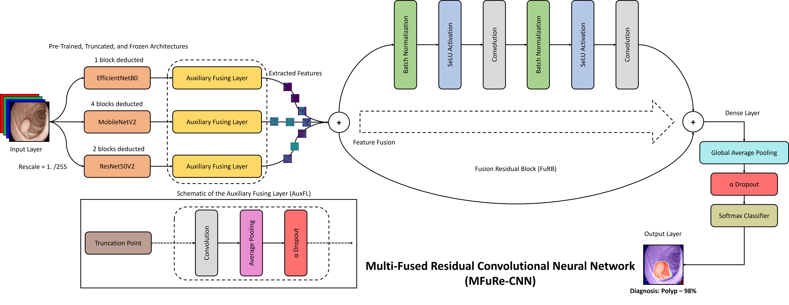

# MFuRe-CNN: Reproducible GI Disease Diagnosis from Endoscopy Images

[](https://doi.org/10.1016/j.bspc.2022.103683)
[](https://doi.org/10.1016/j.mex.2022.101925)

Official implementation and experiment assets for:

> **Diagnosing gastrointestinal diseases from endoscopy images through a multi-fused CNN with auxiliary layers, alpha dropouts, and a fusion residual block**
> *Biomedical Signal Processing and Control (BSPC), 2022*

This repository provides the notebook pipelines, pretrained weight workflow, and explainability utilities for **MFuRe-CNN** and **MFNR-CNN** on gastrointestinal endoscopy classification.

---

## Why this repository exists

This project is organized to help researchers and engineers:

- Reproduce the BSPC 2022 results quickly.
- Re-train all model variants used in the paper.
- Evaluate and test with Grad-CAM and sample images.
- Reuse the pipeline for future studies, benchmarks, and practical deployments.

If you use this work in publications, products, or derivative research, please cite the papers below.

---

## Paper, DOI, and citation

- BSPC paper: https://www.sciencedirect.com/science/article/pii/S1746809422002051
- DOI: https://doi.org/10.1016/j.bspc.2022.103683
- Methods companion paper: https://doi.org/10.1016/j.mex.2022.101925

### BibTeX

```bibtex
@article{montalbo2022mfure,
  title   = {Diagnosing gastrointestinal diseases from endoscopy images through a multi-fused CNN with auxiliary layers, alpha dropouts, and a fusion residual block},
  author  = {Montalbo, Francis Jesmar P.},
  journal = {Biomedical Signal Processing and Control},
  volume  = {76},
  pages   = {103683},
  year    = {2022},
  doi     = {10.1016/j.bspc.2022.103683}
}

@article{montalbo2022methodsx,
  title   = {Fusing compressed deep ConvNets with a self-normalizing residual block and alpha dropout for a cost-efficient classification and diagnosis of gastrointestinal tract diseases},
  author  = {Montalbo, Francis Jesmar P.},
  journal = {MethodsX},
  year    = {2022},
  doi     = {10.1016/j.mex.2022.101925}
}
```

---

## Maintainer

- **Author:** Dr. Francis Jesmar P. Montalbo
- **Affiliation:** Batangas State University
- **Email:** francismontalbo@ieee.org
- **Webpage:** https://francismontalbo.github.io

---

## Repository structure

```text
mfurecnn/
├── 000-005-*.ipynb          # Training notebooks (MFuRe/MFNR × alpha/standard/no dropout)
├── 006-Evaluator.ipynb      # Aggregate evaluation notebook
├── 007-Tester_with_gradcam.ipynb
├── 008-gradcams.ipynb       # Explainability notebook variants
├── src/mfurecnn/            # Production Python package (TensorFlow + PyTorch modules)
├── scripts/predict.py       # TensorFlow CLI for single-image inference
├── scripts/predict_torch.py # PyTorch CLI for single-image inference
├── data/                    # Place extracted prepared dataset here
├── models/                  # Place extracted pretrained weights here
├── test_samples/            # Example inference images
├── graphics/                # Figures used in paper/docs
├── requirements.txt
├── REPRODUCIBILITY.md
├── EXPERIMENTS.md
└── pyproject.toml
```

---

## Datasets

This work uses GI endoscopy datasets including:

1. **Kvasir Dataset**
   https://datasets.simula.no/kvasir/
   Citation: https://dl.acm.org/doi/abs/10.1145/3083187.3083212

2. **ETIS-Larib Polyp DB**
   https://polyp.grand-challenge.org/EtisLarib/
   Citation: https://link.springer.com/article/10.1007/s11548-013-0926-3/

### Prepared data and weights

For fast reproduction, download the prepared artifacts from:

- https://drive.google.com/drive/u/2/folders/1ke0kWhgzjlBQkle4Z0Fh31dnl5ny_HLf

Then extract:

- `data.rar` → `mfurecnn/data/`
- `models.rar` → `mfurecnn/models/`

---

## Quickstart (recommended path)

### 1) Environment setup

```bash
git clone <your-fork-or-this-repo-url>
cd mfurecnn
python -m venv .venv
source .venv/bin/activate  # Windows: .venv\Scripts\activate
pip install --upgrade pip
pip install -r requirements.txt
pip install -e .
```

> If you do not have a GPU, install CPU TensorFlow by replacing `tensorflow-gpu` with `tensorflow`.

### 1B) Optional PyTorch environment

```bash
pip install -r requirements-pytorch.txt
# or: pip install -e .[pytorch]
```

The PyTorch path is an engineering-grade implementation of the paper-inspired fusion residual logic for cleaner deployment pipelines while preserving notebook-first TensorFlow reproducibility.


### 2) Fast evaluation (no retraining)

1. Download prepared dataset + model weights.
2. Launch Jupyter: `jupyter notebook`
3. Open `006-Evaluator.ipynb`
4. Run **Kernel → Restart & Run All**
5. Choose model combo using:
   - `architecture ∈ ['MFuRe', 'MFNR']`
   - `condition ∈ ['alpha', 'standard', 'no']`

### 3) Testing + visual explainability

- Open `007-Tester_with_gradcam.ipynb` to classify sample cases.
- Set `case` to:
  - `0`: normal
  - `1`: ulcer
  - `2`: polyp
  - `3`: esophagitis
- Use `008-gradcams.ipynb` for additional CAM visualizations.

### 4) CLI inference for deployment workflows

```bash
python scripts/predict.py \
  --model models/<your_model_file> \
  --image test_samples/normal.jpg
```

For PyTorch checkpoints:

```bash
python scripts/predict_torch.py \
  --checkpoint models/<your_model_checkpoint>.pt \
  --image test_samples/normal.jpg
```

Both CLIs return JSON predictions that can be integrated into APIs, experiment trackers, or batch pipelines.

---

## Full retraining path (research workflow)

To regenerate models from scratch:

1. Prepare dataset under `data/`.
2. Run one or more training notebooks:
   - `000-MFuReCNN_alpha_do.ipynb`
   - `001-MFuReCNN_standard_do.ipynb`
   - `002-MFuReCNN_no_do.ipynb`
   - `003-MFNRCNN_alpha_do.ipynb`
   - `004-MFNRCNN_standard_do.ipynb`
   - `005-MFNRCNN_no_do.ipynb`
3. Generated/updated weights will be saved under `models/`.
4. Re-run evaluation and tester notebooks.

See [`REPRODUCIBILITY.md`](REPRODUCIBILITY.md), [`EXPERIMENTS.md`](EXPERIMENTS.md), and [`ARCHITECTURE.md`](ARCHITECTURE.md) for controls, run templates, and production module layout.

---

## Reproducibility and production-readiness notes

- Pin dependency versions using `requirements.txt`.
- Use the package in `src/mfurecnn` for reusable layers/utilities instead of copying notebook cells.
- Lock random seeds and document hardware/software setup for every run.
- Keep a separate immutable copy of trained checkpoints per experiment.
- Track metrics and confusion matrix artifacts for each variant.
- Export and version Grad-CAM outputs for auditability in clinical AI workflows.

---

## SEO / discoverability keywords

GI disease diagnosis, gastrointestinal endoscopy AI, endoscopy image classification, MFuRe-CNN, MFNR-CNN, multi-fused CNN, fusion residual block, alpha dropout, medical imaging deep learning, explainable AI for endoscopy, Grad-CAM gastrointestinal datasets, Kvasir, ETIS-Larib polyp detection.

---

## Acknowledgements

- Score-CAM reference implementation: https://github.com/tabayashi0117/Score-CAM

---

## Graphical abstract


